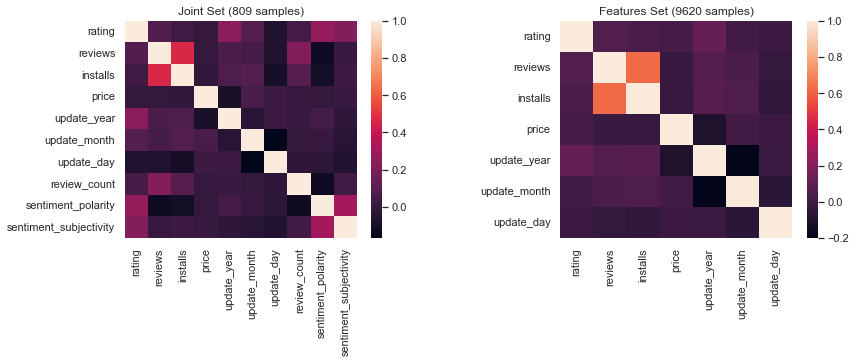
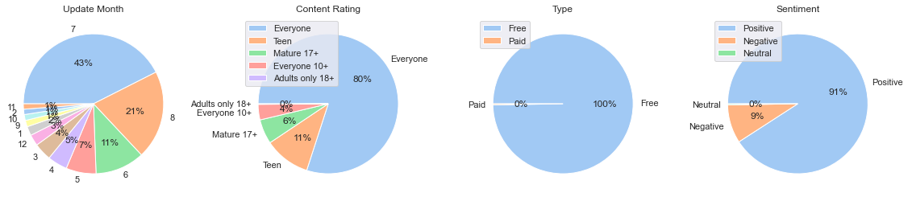

# Google-Apps-Analysis
[Google-Apps-Analysis](https://github.com/GOliviero92/Google-Apps-Analysis "data analysis") is a data analysis project to obtain, combine, clean, analyze the google store apps data. The project is written as jupyter notebooks and should be run in the following order.

* data_cleaning.ipynb (Cleaning Google Store Apps data)
* data_analysis.ipynb (Analysing Google Store Apps data)
* ML analysis (TODO)
* Sentiment analysis (TODO)

### Analysis Results
The selected analysis results are presented below.
* Correlation heatmap of numerical features:

  

* Percentage distributions of selected categorical features:

  

### References
[1] Lavanya Gupta, [Google Play Store Apps](https://www.kaggle.com/datasets/lava18/google-play-store-apps), (2022)
